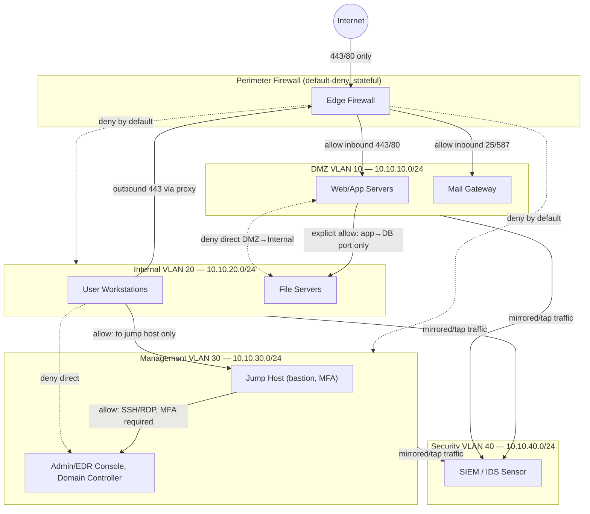

# Network Segmentation Design

Zero-trust-leaning segmentation for a small corporate network: internet
traffic never reaches internal/management zones directly, east-west
traffic between zones is default-deny, and the management VLAN is
reachable only via a jump host.

## Design principles applied

1. **Default-deny at every boundary** — DMZ, Internal, and Management
   VLANs only accept the specific flows listed above; everything else is
   dropped and logged.
2. **No direct DMZ → Internal path** except the single explicit
   application-to-database port required by the web tier — this is the
   control that would have stopped the Lab 2 scenario's SQL injection
   from reaching internal systems even if the web app were compromised.
3. **Management plane isolation** — the Domain Controller and EDR
   console are only reachable via a bastion/jump host requiring MFA;
   workstations cannot reach them directly, containing the Lab 4
   ransomware scenario's lateral-movement path.
4. **Full traffic visibility** — every VLAN is mirrored to a dedicated
   security segment running the IDS sensor (`suricata_custom.rules`) and
   feeding the SIEM (Lab 2's detection engine).

See `firewall/harden_firewall.sh` for the nftables implementation of the
perimeter and inter-VLAN rules, and `ids/suricata_custom.rules` for the
IDS signatures monitoring each segment.
